# The Mimir MVP — a pilot for the Danish apartment and housing-price case

*Denmark, September 2026. What the smallest demonstrable version of the chain is,
what it deliberately leaves out, and what a demo of it does and does not prove.*

Companion to `Mimir-forecast-chain.md`, which describes the full chain. This
document describes only the pilot.

The scoping rule: **freeze both ends of the chain and light up the middle.**
The middle is where the analyst decides, and the analyst deciding is the thing
worth demonstrating. Both ends are where the platform questions live — hosting,
model gateway, orchestration — so freezing them means the demo can be built and
shown before any of those are settled.

---

## The pilot at a glance

```mermaid
flowchart LR
    SRC["Sources<br/><i>frozen · Sept 2026 files</i>"]
    WATCH["Source watch<br/><i>daily</i>"]
    G0{{"GATE 0<br/>fresh?"}}
    P1["AGENT P1 · RESEARCH<br/><i>pre-computed output</i>"]
    G1{{"GATE 1 · review<br/><b>SLIDERS + REASON</b>"}}
    G1B{{"GATE 1b · overlay<br/><b>LEVEL BY HAND</b><br/><i>layer, not blend</i>"}}
    P2["AGENT P2 · FORECAST<br/><b>linear regression · in-process<br/>~1 s · zero LLM</b>"]
    G2{{"GATE 2 · sign-off<br/><b>config rows + backtest</b>"}}
    P3["AGENT P3 · CONTENT<br/><i>pre-computed drafts</i>"]
    G3{{"GATE 3 · red pen<br/><b>edit + journal</b>"}}
    CHK["p3 check<br/><i>code, 0 tokens — binds every number</i>"]
    OUT["Published PAGE<br/>chapter + machine-built source list"]
    LOOP["LEARNING LOOP<br/><i>record only</i>"]

    SRC --> WATCH --> G0 --> P1 --> G1 --> P2 --> G1B --> G2 --> P3 --> G3 --> CHK --> OUT
    G1 -.-> LOOP
    G1B -.-> LOOP
    G3 -.-> LOOP

    classDef live fill:#1f6f43,stroke:#0d3b23,color:#ffffff
    classDef frozen fill:#e9e9e9,stroke:#9a9a9a,color:#333333
    classDef cut fill:#f6f6f6,stroke:#c4c4c4,color:#8a8a8a,stroke-dasharray:5 5

    class G1,G1B,G2,P2,G3,CHK,OUT live
    class SRC,P1,P3,LOOP frozen
    class WATCH,G0 cut
```



Green is live and interactive. Grey is present but frozen or read-only. Dashed
is out of scope.

Two departures from the full chain's diagram, stated rather than implied. The
learning loop's return arrows into P1 and P3 are gone — with both agents
pre-computed there is nothing to inject into. And `p3 check` is drawn as its own
node, because in a demo it is the visible proof that no number reaches the page
unbound.

---

## Node by node

| Node | In the pilot | Why |
|---|---|---|
| **Sources** | **Frozen** — the September 2026 files as they stand | A demo does not need live ingestion to show a decision |
| **Source watch** *(code, daily)* | **Cut** | Nothing to watch in a frozen round |
| **GATE 0 · fresh?** | **Cut** — a static "sources as of 1 Sep 2026" line | The round does not start; it is already open |
| **AGENT P1 · Research** | **Pre-computed** — the gate-approved `master_exogenous.xlsx`, `rapport.csv`, `konsensus.csv`, `poster/*.json` with their verbatim quotes | Sidesteps the WebSearch/WebFetch dependency entirely, which is otherwise a blocker on every platform |
| **GATE 1 · review** | **LIVE.** Driver table, sliders, mandatory reason, the agent's value beside the analyst's | This is the demo |
| **AGENT P2 · Forecast** | **LIVE, in-process — linear regression** on the adjusted driver vector | The only compute in the pilot. Two segments, two drivers, quarterly data from 1989 — this runs in milliseconds. See *The model in the pilot* below |
| **GATE 2 · sign-off** | **LIVE.** Config rows are editable — Tobin’s Q series, transform, terms — and the model refits while the backtest re-scores it | Built out beyond the original read-only scope |
| **AGENT P3 · Content** | **Pre-computed** — the drafts that already verify: Huspriser 27/27, etageboliger sub-section 20/20 | The pilot shows the loop, not the writing |
| **GATE 3 · red pen** | **LIVE, simple.** Edit box, journal the correction | Rule-injection is phase 2 |
| **Published report** | **LIVE as a page**, not Word. `p3 check` runs for real | Pure code, zero tokens. A *failing* check is the better demo moment |
| **LEARNING LOOP** | **Record only** — append to `haendelser.jsonl` | Measure and inject cannot be demonstrated at three rounds a year |

---

## What the sliders may touch, and what they may not

The full chain's rule at gate 2 is that the analyst adjusts config rows, never
numbers: *a hand-edited value is untraceable; a weight is not.* The pilot keeps
that rule, which decides the slider design:

| Set by hand | Verdict | Mechanism |
|---|---|---|
| A **driver value** (gate 1) | **Yes** | Already exists as `vintages.human_central` — 78 values set |
| A **config row** (gate 2) | **Yes** | Tobin's Q series, transform, terms — the backtest re-scores it |
| A **forecast level** (gate 1b) | **Yes, as a separate layer** | See below. Added on request after the pilot was first scoped |

Every commit carries a reason kept verbatim, and the value it departed from
stays beside it — that is what lets a later round measure which of the two was
closer.

### Gate 1b · the exception, and what makes it safe

The original scoping of this pilot said *sliders on inputs, never on outputs*,
on the grounds that `p3 check` exits 1 on any number not bound to a source and
that the loop cannot measure a free edit. That objection was right about the
danger and wrong about the conclusion: the chain already admits the case —
sometimes no source can be connected and the analyst has to set the assumption
themselves, a political change with no published calculation of its effects
being the standing example. Refusing to represent that does not remove it; it
pushes it into a spreadsheet nobody audits.

So gate 1b exists, built as a **layer rather than an edit**. Four properties,
none optional:

1. **A layer, never a blend.** The model line and the overlay line are both
   kept and both drawn. What the model said stays visible.
2. **The analyst is the source.** The number binds to `analytikerskøn` with a
   date and the reason given, so every figure still binds. The rule was never
   "a number must come from a document"; it was "a number must have a source
   you can name".
3. **Not attributable to a driver, and it says so.** The decomposition carries
   the overlay in its own row, marked as judgement. An overlay that appeared
   quietly inside the Tobin's Q contribution would be the real dishonesty.
4. **Annual level only.** The analyst sets the year; the model keeps the
   within-year profile. Setting every quarter by hand is not judgement, it is a
   different forecast.

**The cost, stated rather than buried:** the backtest scores the model, so it
cannot validate an overlay. An overlay is measurable against the outcome but not
against the method, and a round in which overlays carry most of the movement is
a round in which the model has stopped producing the forecast. The journal
counts them for exactly that reason.

### The slider set is small, and that is a feature

Every Danish residential model runs on exactly two drivers: a segment-specific
Tobin's Q and the real mortgage rate. So the pilot needs three or four sliders,
not twenty-nine:

- Real mortgage rate
- Construction costs
- House prices — feeding Tobin's Q
- Consumer confidence, optional, for Holiday houses

This is where the demo earns something a memo cannot. Because `hpi` is defined
as **enfamiliehuse only** — all 39 claims — and the same numerator feeds Tobin's
Q for Detached houses, Flats *and* Holiday homes, the house-price slider
currently moves single-family prices into the apartment model. Show it live. It
makes the case for admitting Nykredit and Nordea Kredit better than any
argument on paper.

---

## The model in the pilot

**Linear regression, not the production ensemble.** `LRA` is already a model
type in `model_library.py` — Office, Education, Other buildings and Transport
all use it, and the Office model is a log-log OLS — so this is an in-house
method, not a shortcut around the method.

The specification, per segment:

```
log(starts) = a
            + b1 · Tobins_Q_<segment>
            + b2 · Real_Interest_rate_Mortgage
            + quarterly seasonal dummies
```

Fitted on the quarterly sample in `master_endogenous.xlsx` and
`master_exogenous.xlsx`. Two segments: `Flats` and `Detached_houses`.

**Why linear regression is the better choice here, and not merely the easier
one.** The production `Flats` model is a five-member ensemble — seasonal naive,
AR4, a combined ECM, a pure SARIMA and the Hubexo pipeline overlay capped at
four quarters. Under a slider that gives jumpy, discontinuous response: the
overlay stops contributing past h4, and the seasonal-naive member does not react
to drivers at all. An analyst moving a slider would see movement they cannot
attribute.

Linear regression gives the opposite: response that is smooth, monotonic and
attributable. *A one percentage point rise in the real mortgage rate lowers
apartment starts by b2 per cent.* That sentence is the thing the whole product
claims to be able to say — the ability to **name a cause** rather than
extrapolate history — and OLS is the only specification in the set where the
demo can say it out loud and be exactly right.

It also makes decomposition exact rather than approximate. `model_decomposition.py`
exists to say which driver moved the forecast and by how much; with OLS that is
coefficient times driver change, with no residual to explain away. The demo can
show a two-bar attribution beside every slider move.

**The signs are a test, not a formality.** The production config records that
the combined ECM for Flats has the correct long-run signs — Tobin's Q positive,
the rate negative. The pilot's regression must reproduce them. If it does not,
that is a finding to report, not a fit to adjust until it agrees.

**What this costs.** The pilot forecast is no longer the production forecast.
Accuracy will be worse than the ensemble's 32.4 per cent at four quarters,
because the ensemble weights were set by hold-out backtest for exactly that
reason. So the pilot must label its output a **demo model** and report its own
hold-out error beside the production figure. What it may not do is present a
linear-regression number as the house forecast — the Temporal parity proof
established that the number the interface shows is the number the round
produces, and a substituted model breaks that property for as long as it stands.

Phase 2 restores the ensemble behind the same API, at which point the interface
does not change.

---

## One implementation, not two

The existing approval console proves that its browser forecast matches the
Python model — which means a second implementation of the ensemble exists in the
browser. Two implementations of an econometric ensemble is a permanent parity
liability, and the failure mode is silent: the browser shows a number the batch
round would not produce.

The pilot avoids it. The page holds no model. It posts the adjusted driver
vector to a warm service that runs the real `model_runner.py` and returns the
result. Same code for the slider and for the round — the same argument as the
Temporal parity proof, extended to the interface. It makes the console's parity
tests unnecessary rather than load-bearing.

---

## Where it runs

**Locally, and only locally — and that is now the decision, not a stage.**
`uvicorn` on `127.0.0.1`, opened in a browser. Every teammate runs it the same
way on their own machine: clone, one command, browser. There is no container, no
Codespace, no cloud host and no database, and the Dockerfile and devcontainer
that briefly existed were deleted so there is exactly one way to start it.

The reason is not only simplicity. The driver pages show verbatim quotes from
licensed bank research, which is the same thing that has kept the production
approval console undeployed. On `127.0.0.1` that question never has to be
answered, and no licensed material leaves the machine.

Nothing about this forecloses a later hosting decision — it is a FastAPI app
over local files, and whatever eventually hosts it takes the same code. That
decision belongs after the pilot has shown the workflow is worth hosting, and
it is not this document's to make.

For the specific question of whether the round could run as a **Databricks
Lakeflow pipeline**, see `Databricks-Lakeflow-assessment.md`. The conclusion in
one line: Lakeflow is the right place for the data and the wrong place for the
decisions — a declarative pipeline cannot wait for a human, and waiting is what
the gates are.

What the pilot does **not** need, and should not carry: Temporal (gates only
earn durable waits when they wait for weeks), Postgres (2,078 claims and 3,485
rows — SQLite is correct at this size), a model gateway (no LLM runs at demo
time), multi-country, R&M, Anlæg, and every segment beyond `Flats` and
`Detached_houses`.

The shape of it:

```
one container
├── FastAPI
│   ├── GET  /                 the page
│   ├── GET  /api/drivers      agent value · institutions' forecasts · override
│   ├── POST /api/forecast     adjusted drivers → OLS refit/predict → JSON
│   │                          + exact per-driver decomposition
│   ├── POST /api/decision     journals the override and its reason
│   └── POST /api/publish      p3 check → page
├── one HTML page, vanilla JS, a chart library   (no build step)
└── the existing SQLite and xlsx files, untouched
```

---

## How it looks to the analyst

Wireframes, not screenshots — nothing is built yet. **Every number and quote
below is illustrative.** Verbatim quotes are shown as `‹…›` placeholders rather
than invented text, because a document that fabricates a quote from
Nationalbanken to demonstrate a quote-checking system has failed at its own
premise.

### 1 · Gate 1 — the driver review

```
┌──────────────────────────────────────────────────────────────────────────┐
│ Mimir · Denmark · September 2026            sources as of 1 Sep 2026     │
│ ●GATE 1 review    ○GATE 2 sign-off    ○GATE 3 red pen    ○Publish        │
└──────────────────────────────────────────────────────────────────────────┘

 MARKET DRIVERS · the analyst approves every value              4 of 12 done
 ──────────────────────────────────────────────────────────────────────────
                        agent   DØR    ØM     your value
 Real mortgage rate      3.10 ⓘ  2.90   3.05   [ 3.10 ]      ○ approve
 2026 · pct             2.0 ├────────●─────────────┤ 4.5
                        ⚠ needs_human · no source beyond 2027

 House prices, flats    15.0 ⓘ   —      —      [ 15.0 ]      ○ approve
 2026 · pct y/y        -5.0 ├──────────●────────┤ 25.0
                        ⚠ hpi is enfamiliehuse only — this slider moves
                          detached-house prices into the apartment model

 Construction costs      0.2 ⓘ   —     0.40    [ 0.2  ]      ● approved
 2026 · pct y/y        -2.0 ├───●─────────────────┤ 6.0        Lasse · 3 Sep

 Consumer confidence    -9.9 ⓘ   —    -8.0     [ -9.9 ]      ● approved
 2026 · balance         -25 ├─────●────────────────┤ 5         Lasse · 3 Sep
 ──────────────────────────────────────────────────────────────────────────
 ⓘ click any agent value for its verbatim quote

                                              [ Run forecast → ]
```

Only two of these sliders reach the residential models — the mortgage rate and,
through Tobin's Q, house prices. The other two are shown because the analyst
approves every driver whether the model eats it or not.

### 2 · Click any number — the quote behind it

```
┌─ Real mortgage rate · 2026 · 3.10 pct ───────────────────────────────┐
│                                                                      │
│  "‹the sentence as printed in the source, word for word›"            │
│                                                                      │
│  Økonomisk Redegørelse, august 2026 · published 27 Aug 2026          │
│  claim 1842 · source oem · tier 1 · cluster dk_public                │
│                                                                      │
│  triangulated from 3 claims   ØM 3.05 · DØR 2.90 · Nordea 3.20       │
│  w = tier × recency × definition match × independence × skill        │
│                                                                      │
│  efterprøv  V2b igangværende — 2026 estimate still reachable ✓       │
│             V5 skala — pct, not basis points ✓                       │
│                                                        [ close ]     │
└──────────────────────────────────────────────────────────────────────┘
```

This panel is the pilot's strongest single feature and it needs no new work —
every claim in the database already carries its quote, its source and its
weights. Surfacing them is a query.

### 3 · Override — the reason is the point

```
┌─ Override · Real mortgage rate · 2026 ───────────────────────────────┐
│                                                                      │
│  agent proposed   3.10          your value   2.60                    │
│                                                                      │
│  Why?  kept verbatim — the agent reads this before the next round    │
│  ┌────────────────────────────────────────────────────────────────┐  │
│  │ ‹the analyst's own words›                                      │  │
│  │                                                                │  │
│  └────────────────────────────────────────────────────────────────┘  │
│                                                                      │
│  ✓ guard passed — inside the declared hard_lo / hard_hi              │
│                                                                      │
│  The agent's 3.10 is kept beside yours, so a later round can         │
│  measure which was closer.                                           │
│                                                                      │
│                                   [ cancel ]  [ commit override ]    │
└──────────────────────────────────────────────────────────────────────┘
```

And the refusal, which is worth demonstrating deliberately:

```
┌─ Override · Real mortgage rate · 2026 ───────────────────────────────┐
│  agent 3.10          your value  -1.20                               │
│                                                                      │
│  ✗ guard REFUSED — below hard_lo, declared in config                 │
│    A series that has never been below zero may not go below zero.    │
│    Change the value, or change the config row at gate 2.             │
│                                                       [ cancel ]     │
└──────────────────────────────────────────────────────────────────────┘
```

Four things stop a number and no more. The demo should show one of them
refusing, because a control nobody has seen refuse is a claim, not a control.

### 4 · The forecast, and what moved it

```
┌──────────────────────────────────────────────────────────────────────────┐
│ ●GATE 1 ✓   ●GATE 2 sign-off   ○GATE 3   ○Publish       ⚠ demo model    │
└──────────────────────────────────────────────────────────────────────────┘

 FLATS · new starts, dwellings per quarter        OLS · hold-out MAPE h4 ▒▒
 ──────────────────────────────────────────────────────────────────────────
  4 000 ┤                                        ·························
        ┤                                  ······    band, ±1 se
  3 000 ┤         ────────╮        ╭───────────────────────────
        ┤   actual         ╰────────╯     forecast
  2 000 ┤
        └────┬────────┬────────┬────────┬────────┬────────┬────────┬──────
           2021     2022     2023     2024     2025     2026     2027

 WHAT MOVED IT · against the agent's proposal
 Real mortgage rate   3.10 → 2.60   ████████████████████        +6.1 %
 House prices         15.0 → 15.0   ·                             0.0 %
                                    ──────────────────────────────────
                                    net effect on 2027 starts     +6.1 %
 ──────────────────────────────────────────────────────────────────────────
 ⚠ Demo model — linear regression, not the production ensemble.
   Production Flats: 5-model ensemble, OOS MAPE h4 32.4 %.

                              [ ← gate 1 ]        [ Sign off → ]
```

The attribution bars are exact rather than approximate, which is the whole
reason for choosing linear regression. This screen is where the product's
central claim — *name the cause* — becomes something a stakeholder can watch
happen.

### 5 · Gate 3 — the red pen

```
┌──────────────────────────────────────────────────────────────────────────┐
│ ●GATE 1 ✓   ●GATE 2 ✓   ●GATE 3 red pen   ○Publish                       │
└──────────────────────────────────────────────────────────────────────────┘

 HUSPRISER · draft            27 of 27 numbers verified   ✓ p3 check passed
 ──────────────────────────────────────────────────────────────────────────
  ‹the drafted chapter, as written by P3 in the September round›

  Every figure carries a superscript to its binding:
      15,0 pct.[1]        [1] Nykredit · Boligprisprognose · 2 Jul 2026
       6,6 pct.[2]        [2] DST EJ56 · EJENDOMSKATE 0111 · 2026K1
       8,4 pp [3]         [3] husberegning · metode declared in rapport_dk.yaml

  ┌─ your edit ──────────────────────────────────────────────────────────┐
  │ ‹the sentence, rewritten›                                            │
  │                                                                      │
  │ reason: ‹why the house writes it this way›                           │
  └──────────────────────────────────────────────────────────────────────┘
  → journalled. If the same correction returns, it becomes numbered
    style rule 44 and P3 reads it before it writes.

                                                       [ Publish → ]
```

### 6 · Published

```
┌─ Published · Huspriser · Denmark · September 2026 ───────────────────┐
│                                                                      │
│  ✓ p3 check      27 of 27 numbers bound to a source                  │
│  ✓ style         43 rules enforced                                   │
│  ✓ source list   built by machine — not typed                        │
│                                                                      │
│  KILDER                                                              │
│  Nykredit · Boligprisprognose Danmark · 2 Jul 2026                   │
│  Nordea Kredit · Ny boligprisprognose · Jan 2026                     │
│  Danmarks Statistik · EJ56 · EJENDOMSKATE 2103 · 2026K1              │
│  Økonomisk Redegørelse · august 2026 · 27 Aug 2026                   │
│  Det Økonomiske Råd · Dansk Økonomi, forår 2026 · 1 May 2026         │
│  ‹…›                                                                 │
│                                                                      │
│                                       [ .docx export — phase 2 ]     │
└──────────────────────────────────────────────────────────────────────┘
```

**What the analyst never sees:** a terminal, a Python file, a spreadsheet, a
database, an API key, or the words `master_exogenous`.

---

## The demo, in six steps

1. The page opens on the September round at gate 1. Drivers listed, the agent's
   value beside DØR's and Nationalbanken's.
2. Click the mortgage-rate number. The verbatim quote appears, with its
   publication and date.
3. Move the mortgage-rate slider. Type a reason. Commit — the agent's original
   stays visible beside it.
4. Press **Run forecast**. Apartment and detached starts redraw, with bands, in
   about a second — beside a two-bar attribution showing how much of the move
   came from the rate and how much from prices.
5. Move the house-price slider, and say out loud that it is moving single-family
   prices into the apartment model.
6. Press **Publish**. `p3 check` binds every number or exits 1. The page shows
   the chapter with its machine-built source list.

Four gates visible, no terminal.

---

## What must not be cut

Four things, because without them the demo is a dashboard:

1. **The reason field on every override.** It is the learning loop's entire
   premise. A slider that moves a number without capturing why demonstrates a
   spreadsheet.
2. **The agent's value beside the analyst's.** That is the mechanism a later
   round uses to measure which was closer.
3. **`guard` running on the committed value**, so the demo can show a refusal.
4. **Click any number, see its verbatim quote.** Every claim already carries
   one; surfacing it is a query, not new work. It is the single most
   demonstrable property of the whole system.

---

## Entry criteria

Known defects that should be fixed before the pilot runs, not during. All are
reported by the system itself:

- **`master_exogenous.xlsx` is not updated.** Construction costs stand on the
  old flat rule, not the v3 estimate.
- **`strate` and `ltrate` 2025 are part-year figures**, and
  `real_interest_rate_st` 2025 disagrees with its own components by 0.15
  percentage points. Interest rates are the driver the whole pilot rests on.
- **`mortgage_rate` 2028 has no guard.** No source forecasts that far; the year
  is unverified, not approved.
- **Three open text-versus-model contradictions** in `notes/dk_new_residential.md`
  — consumer confidence, rates and construction costs — open since 8 August.
- **A hard-coded path to a personal OneDrive** in `P3/config/dk.yaml`.
- **The config workbook's own README contradicts its config rows** on segment
  count, horizon and overlay list, and names Alteryx as the entry point.

---

## Honest status

**What the pilot proves:** that an analyst can adjust a driver, see the forecast
move, record why, and publish a chapter in which every number is bound to a
source — without touching a terminal. That is the workflow claim, and it is
worth proving.

**What it does not prove:** that the research agent works unattended, that the
learning loop closes, that the chain survives a second country, or that any of
it runs when the laptop is off. The Temporal parity proof already covers the
model step — 3,485 rows identical between the local and Temporal runs — and it
is the only part of the platform question the pilot inherits as settled.

**What it cannot prove, by construction:** apartment forecast accuracy — twice
over. The production `DK|Flats` ensemble sits at 32.4 per cent OOS MAPE at four
quarters, against 10.1 for detached houses; the Hubexo project pipeline is the
only lever shown to move it, and it buys about three percentage points. And the
pilot does not run that ensemble: it runs a linear regression chosen for
legibility under a slider, which will be less accurate still. The pilot
demonstrates the *workflow* around a forecast, and it must say so. A demo that
shows a confident apartment line rather than a band, or that calls its
regression the house forecast, oversells the pilot on both counts.

---

*The two house rules this document keeps: it does not present a number without
its source, and it does not describe a control as stronger than it is.*
