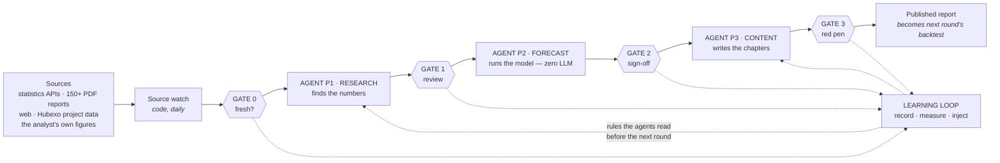

# The Mimir forecast chain

*Denmark, September 2026. How a construction forecast is produced end to end —
every source, every agent, every place a human decides, and the return path that
carries the analyst's corrections back into the models' context.*

The design rule the whole thing follows: **deterministic code wherever code can
do it; the language model only where language is the work.** Agent P2, which
produces the actual forecast, contains no model at all.

---

## The chain at a glance

Four human gates. Nothing reaches the model, the forecast or the customer
unseen.

| Gate | Agent | What the analyst decides |
|---|---|---|
| **0 · fresh?** | — | Whether the sources are in. The round starts because the analyst says so, not because a date arrived. |
| **1 · review** | P1 | Every driver value. Accept the triangulated estimate, or record their own — the agent's figure is kept beside it, so the loop can later measure which was closer. |
| **2 · sign-off** | P2 | Reads the backtest and the decomposition, then adjusts **config rows** — never the numbers. A hand-edited value is untraceable; a weight is not. |
| **3 · red pen** | P3 | The text. When the check is clean, every *number* is verified; whether the *sentence around it* is true, no deterministic control can see. |

---

## Agent P1 · Research

Finds the numbers. Triangulates 10+ sources into one path per market driver.
Every number is printed in a source and carries its verbatim quote.

### The contract — a door, not a plea

1. **A number must be PRINTED.** A model may copy a figure it can see in a
   document; never derive, round or "remember" one. The quote must be
   re-findable, word for word.
2. **The source is the document, not the model.** Every claim carries a
   report id and its quote. If the quote cannot be found again, the number is
   discarded — even when it looks right.
3. **No access to the number path.** Research writes to `claims` only.
   `vintages`, `forecast_quarters` and the xlsx files are reachable only
   through review/exo/export, with the analyst present.

### Research runs in three INDEPENDENT steps

The order is the analyst's priority. It is **not** a dependency: none of the
three reads another's output, they write to three different tables, and steps 2
and 3 can each be switched off while step 1 runs unchanged.

| # | Step | What it does | Writes to |
|---|---|---|---|
| **1** | **Prose extraction** *(LLM)* | Reads the running text of the PDFs we already hold. The cheapest place a number can still be hiding — the reports are downloaded and paid for. | `claims` |
| **2** | **Research subagents** *(LLM)* | Watches the market **outside our approved sources**. Can be switched off. | `source_candidates` |
| **3** | **Sentiment** *(LLM)* | What the experts are saying. Can be switched off. | `sentiment` |

Held in the round's own edges as `extract → kilder → stemning → quantify`. What
*cannot* be switched off: all three land in the database **before** anything is
triangulated. An estimate made before them is made on less than the round had.

**Step 2 is market surveillance, not gap-filling.** The source watch only
fetches new editions from sources we have *approved*. Step 2 covers the rest:

- **Sources we know and deliberately left out** because we trust them less — so
  nobody follows them, and nobody notices when they start publishing something
  usable. They sit in `source_candidates` without being rejected.
- **Reports and publishers that have appeared since the last round.** A new
  publisher is in no list and can only be found by looking.

Where to look is decided by the coverage gaps: holes no further reading can
close, ranked by how much closing one would move. Source hunting costs real
money (~12.4 USD for five runs), so the round only executes a plan the analyst
has already approved — otherwise it writes a new plan and waits.

**Step 3 searches five channels, heaviest first**, each with its own
traceability requirement:

| Weight | Channel | Requirement beyond the verbatim quote |
|---|---|---|
| 1.0 | Press conferences — Nationalbanken, ECB, Finansministeriet, DST, DØRS | Name the meeting and date; quote from minutes, transcript or recording — not a journalist's summary |
| 0.6 | Trade bodies — DI Byggeri, 3F, TEKNIQ, EjendomDanmark … | The organisation's own statement ahead of the trade press's report of it |
| 0.4 | Trade press — Licitationen, Building Supply, Ingeniøren … | The sender is the person quoted, not the magazine |
| 0.4 | News media — Børsen, Finans, DR, TV 2 … | **Only** with a named expert and their role. The paper's own view does not count |
| 0.2 | Social media — LinkedIn, X | **Only** named experts under their own name, and only where the post can be quoted verbatim |

The rule that matters most: **the publisher is who SAID it, not who printed
it.** If Licitationen reports that DI Byggeri's chief economist expects falling
activity, the publisher is DI Byggeri. Otherwise the same statement counts as
several independent signals every time a magazine repeats it, and the index
measures press coverage instead of sentiment.

Sentiment is kept in its own table with **no value column, by design**. It may
flag a divergence for the review gate; it may never become a claim or move a
number. A quote carrying a number with a horizon *is* a claim and is routed
away to the inbox instead.

### The three controls that are easy to confuse

| | When | Looks at | Can it stop a number? |
|---|---|---|---|
| **`validate`** | Before the human gate | The agent's *proposals* | **No.** It points, and nothing else |
| **`guard`** | After the analyst decided | The *confirmed* values, expanded to the quarterly path | **Yes** — but only the definitionally impossible |
| **`efterproev` (V1–V6)** | On demand | A number's *basis* | No. It reports |

**`validate`** collects what needs human eyes and hands it to the gate: sign
conflicts, thinly supported proposals, no calculation, no source, direction, and
a proposal that contradicts the year so far by more than 3 percentage points.
One flag per driver and type — otherwise the same objection appears three times
for three horizon years. It is deliberately rules and not a model: *a rule can
be checked; a model's hunch cannot.*

**`guard`** is the exit barrier. Only four things stop a number: it is not a
number; it is negative on a series that has never been below zero; it is under a
`hard_lo` **declared in config**; it is over a `hard_hi` **declared in config**.
Everything else warns — because a guardrail that stops an unusual but *correct*
number is worse than no guardrail. 2022 gave 65 % material shortage and a
51-index-point jump in retail confidence; a historical limit would have made the
agent lie about reality.

Hence the rule that what cannot be *derived* must be *declared*. The instructive
counterexample: `Share of e-commerce` sits in [0, 1] across its whole history,
but the recipe is e-commerce divided by *physical* retail — a ratio, which can
exceed 1 if e-commerce overtakes physical trade. A [0, 1] bound derived from
history would have blocked a correct number.

**`efterproev` (V1–V6)** asks something else entirely: not whether the number is
plausible, but whether it is *measured as it claims to be*.

| | Question | What it caught |
|---|---|---|
| **V1 BASIS** | Are annual average, end-of-year and Q4 level kept apart? | Basis is derived from config; an unknown basis is reported, not guessed |
| **V2 DELÅR** | Is a claimed annual value in fact half a year? | **The interest rates.** `strate` 2025 matched Jan–May better than the full year; `ltrate` matched Jan–Apr |
| **V2b IGANGVÆRENDE** | Can this year's estimate still be reached, given what is realised? | `ltrate` 2026 at 2.243 required the rate to average **1.45** over the last five months, from 3.07 today |
| **V3 KONTINUITET** | Does the path connect to the last actual? | Jumps beyond 2.5 standard deviations |
| **V4 ÅRGANG** | Was the source published *before* the event that changed everything? | Registered regime shifts per driver |
| **V5 SKALA** | Percent, percentage points, basis points or index? | Unit errors: 250 where 2.50 belongs |
| **V6 IDENTITET** | Do the derived columns' arithmetic hold against their own components? | `real_interest_rate_st` 2025: the file says 0.2832, but `strate − infl` = 0.4327 |

V2 deliberately does *not* ask "is the value possible" — that test is too weak.
Both wrong rate values sat comfortably inside their monthly range. The test that
catches them asks something sharper: *does the value match a PREFIX of the year
better than the full year?* Two independent series then pointed at the same
cut-off month.

---

## Agent P2 · Forecast

The agent with no model inside it: every step is deterministic — same input,
same forecast, every time. The analyst's autonomy lives in a config
spreadsheet, and the backtest is the referee.

| Input | What it is |
|---|---|
| `master_exogenous.xlsx` | Market drivers, gate-approved from P1 |
| `master_endogenous.xlsx` | Building-starts history: a local mix of national statistics and Hubexo project data |
| `master_forecast_config.xlsx` | **The instruction** — one row per model: `model_type` · variables · transforms · lags · weights |
| Hubexo project data | Planned and ongoing projects → expected starts, via realisation and slip |

`run_all.py` reads the config and runs every row. Econometric ensembles are
crossed with the project-market pipeline; weights are set by hold-out backtest,
no winner-take-all. `model_decomposition.py` says which driver moved the
forecast and by how much — which is what lets the report **name a cause**
instead of extrapolating history.

After gate 2: the regional split, production value from the central norm
calculation, and building times that spread starts into activity over time.

Scope today is **new construction only**; the business case adds an R&M model.

---

## Agent P3 · Content

Writes the chapters, with as few tokens as possible. Python does the heavy
reading; the model reads only the brief.

1. **Python, 0 tokens.** Word reports → full-text search. Spreadsheets → facts
   plus revisions against the prior vintage. Chapter drivers at a point-in-time
   cut — *a delivery is never newer than the forecast*, or the backtest would
   credit the text with knowledge it never had. All of it distilled into **one
   brief per chapter**, ~6–9k tokens, in named blocks.
2. **The writer** *(LLM)* drafts the Danish chapter in the house voice. Numbers
   come only from the brief's own tables — never from memory, never from the
   previous vintage's text.
3. **The cold proof-reader** *(LLM subagent)* sees only the brief and the draft,
   and every finding must quote its evidence verbatim. The writer finds their own
   errors worst: the first run caught an entire draft written on the previous
   vintage's figures — 67 of 67 numbers matched May, 19 of 67 matched September.
4. **The check** *(code)* binds every number to a source — spreadsheet, drivers,
   P1, DST, or a policy row with legal basis — or exits 1. A figure that binds to
   none of them is invented.

Two controls with different jobs: **the check takes the number, the cold
subagent takes the sentence.**

The quality lock reports **coverage and leakage together**, and both are
regression-locked in tests. They pull in opposite directions: loosen the context
filters and coverage rises — and more invented numbers slip through. *Coverage
of 100 % is an alarm, not a target*: it once meant that 100 % of plausible wrong
numbers passed too.

---

## The learning loop

Every gate decision — in the analyst's own words — is recorded, counted and
written back into the agents' context before the next round.

| | | |
|---|---|---|
| **1 · Record** | One append-only journal for all four gates | The analyst's own words are kept verbatim: a paraphrase is already an interpretation, and the words are the signal |
| **2 · Measure** | Did the same correction come back? | Once is a special case. Twice is a systematic fault in the agent — and a "time" is a *round*, not a row |
| **3 · Inject** | An approved rule is written into the context each agent already reads | P1's read-first list; P3's numbered style rules and section notes. Marked, idempotent regions — nobody has to remember it |

The hard question the loop exists to answer: if a correction returns *after* its
rule was written, the rule does not work, and writing it a third time will not
help. That is the difference between a system that gets smarter and one that
just gets longer.

Generalising from "this is what I did this time" to "this is how it must always
be" is the analyst's call, not the model's.

---

## What runs on what

The binding is not "the model" — a company API key could supply that tomorrow.
It is the **tooling**.

| Locked to the Claude Code licence | Why |
|---|---|
| **WebSearch / WebFetch** | Used by research steps 2 and 3. No API path is implemented for them |
| **Subagents** | P1's driver-researcher, source scout, evidence critic; P3's cold proof-reader |
| **Skills** | P3's writer, proof-reading and policy skills |

| Portable today with a company key | Why |
|---|---|
| **Prose extraction** | It runs with *no tools at all*, by design — a quote must be findable in the text the model was given, so the model must not go looking. It needs the model, not the tooling, and the API backend already exists |

Agent P2 is unaffected: no LLM in it.

When the monthly cap was hit in August, source hunting, sentiment and P3's
writer and proof-reader simply stopped.

---

## Honest status

**What works:** the chain runs end to end for Denmark. Sweden, Norway and
Finland have models, but no research or report agent yet.

**What is measured, not assumed:** the recorded corrections at the gates —
121 at the point the learning loop was built, 78 at gate 1 and 43 at gate 3,
imported from where they were already being kept.

**Gate 0 and gate 2 started at zero.** Nothing was ever recorded there. That is
the hole the learning loop closes, and it is worth saying out loud rather than
showing four gates as if they were equally instrumented.

**Two defects the checks currently report and nobody has fixed:** `strate` and
`ltrate` 2025 in the master file are part-year figures, and
`real_interest_rate_st` 2025 disagrees with its own components by 0.15
percentage points. Both are numbers in the production file — the analyst's
call, not the agent's.

**The plumbing:** code, databases and files live on one laptop and in OneDrive.
Three agents, four gates and a dozen scripts, started by hand in the right
order. The approval console exists but is not deployed. These are hosting,
orchestration, access and model-supply problems — solved with standard
components, not new research.

---

*Two things this document deliberately does not do: it does not present a number
without its source, and it does not describe a control as stronger than it is.
Both are house rules that the chain itself enforces.*
